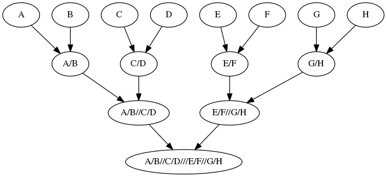

.. _creating_multi_parental_populations:

###################################
Creating Multi-Parental Populations
###################################

This example will provide a walkthrough for how to create populations similar
to the MAGIC protocol. In this example we are not using inbred lines so it is
a slight misnomer to call it the MAGIC protocol; however, when I initially
wrote the code I was not aware of the difference. I will change it before launch.

.. _module_imports:

.. code-block:: python
   :caption: Required modules

   import simuOpt
   simuOpt.setOptions(alleleType='short', quiet=True)
   import simuPOP as sim
   import numpy as np, pandas as pd
   from saegus import breed, parse
   np.set_printoptions(suppress=True, precision=3)

Reload the example population.

.. code-block:: python
   :caption: Load the example population

   example_pop = sim.loadPopulation('example_pop.pop')
   example_pop.addInfoFields(['ind_id', 'mother_id', 'father_id'])
   sim.tagID(example_pop)

Load up the recombination map for this example

.. code-block:: python
   :caption: Load the recombination map

   tf = parse.TusonFounders()
   recom_map = tf.parse_recombination_rates('genetic_map.txt')

.. _example_multi_parental:

Example Multi-Parental Population
=================================

In these examples the term multi-parental population implies that a group of
founders are mated in pairs to create an F\ :sub:`1` population. The
sub-populations created from the pairs of offspring are then mated pairwise.
This process repeats until there is only a single sub-population. It is best
explained with a picture. Suppose you have individuals A, B, C, D, E, F, G, H

.. _multiple_ways:

Multi-Parental Breeding Protocol
================================

Through the course of development I developed several ways to specify creating
a multi-parental multi-generational mating scenario. Each way has it's own
benefits. Some functions allow for more fine-grained control of the specific
crosses. There are functions that can be used with single replicates or multiple
replicates. Each has its own quirks and assumptions because of the way
``simuPOP`` requires the input. Here we will use the most recent and probably
best incarnation of creating multi-parental populations.

.. _creating_the_f1:

Creating the F\ :sub:`1`
------------------------

The first step is unique. In this case we specify pairs of individuals. The
steps that follow this one operate on entire sub-populations. We will create an
F\ :sub:`1` population from ``8`` members from ``example_pop``.

.. note:: We specify individuals using the ``ind_id`` information field so it must be set.

.. code-block:: python
   :caption: Creating the F\ :sub:`1`

   founders = [[1, 2], [3, 4], [5, 6], [7,8]]
   offspring_per_pair = 500
   magic = breed.MAGIC(example_pop, founders, recom_map)
   example_pop.popSize() # prior to mating
   # 105
   magic.generate_f_one(founders, offspring_per_pair)
   example_pop.popSize() # after mating
   # 2000

The new population size is ``2000``. We provided four pairs in ``founders`` and
we specified 500 ``offspring_per_pair``. The result is 500 individuals from
each of the four crosses for a total of 2,000 individuals. We should check
the pedigree to be sure.

Quick Check of the F\ :sub:`1` Pedigree
***************************************

We should have 500 offspring from individuals ``1`` and ``2``, 500 from
individuals ``3`` and ``4``, 500 from ``5`` and ``6`` and 500 from
``7`` and ``8``.

.. code-block:: python
   :caption: Checking the pedigree

   pedigrees = {}
   pedigree = np.array((example_pop.indInfo('ind_id'),
                        example_pop.indInfo('mother_id'),
                        example_pop.indInfo('father_id')))
   print(pedigree[:500])
   # [[ 106.,    1.,    2.],
   #  [ 107.,    1.,    2.],
   #  [ 108.,    1.,    2.],
   #  ...,
   #  [ 603.,    1.,    2.],
   #  [ 604.,    1.,    2.],
   #  [ 605.,    1.,    2.]]
   print(pedigree[500:1000])
   # [[  606.,     3.,     4.],
   #  [  607.,     3.,     4.],
   #  [  608.,     3.,     4.],
   #  ...,
   #  [ 1103.,     3.,     4.],
   #  [ 1104.,     3.,     4.],
   #  [ 1105.,     3.,     4.]]
   print(pedigree[1000:1500])
   # [[ 1106.,     5.,     6.],
   #  [ 1107.,     5.,     6.],
   #  [ 1108.,     5.,     6.],
   #  ...,
   #  [ 1603.,     5.,     6.],
   #  [ 1604.,     5.,     6.],
   #  [ 1605.,     5.,     6.]])
   print(pedigree[1500:2000])
   # [[ 1606.,     7.,     8.],
   #  [ 1607.,     7.,     8.],
   #  [ 1608.,     7.,     8.],
   #  ...,
   #  [ 2103.,     7.,     8.],
   #  [ 2104.,     7.,     8.],
   #  [ 2105.,     7.,     8.]]
   pedigrees[0] = pedigree

Single Replicate Population: MAGIC and Random Cross
---------------------------------------------------

Now that we have the F\ :sub:`1` from the previous step we can continue down
the MAGIC protocol. The approach here is to create arrays of ``ind_id`` to
determine the mating events. Assuming that we have 4 sub-populations with 500
individuals each: we choose 1000 individuals from sub-population 1 to mate with
1000 individuals with sub-population 2. Choose 1000 individuals from
sub-population 3 to mate with 1000 individuals from sub-population 4. The
output is a tuple of arrays so we can "unzip" the return value into different
variables.

.. note:: Sampling is done with replacement. This method ignores sex.

.. code-block:: python
   :caption: Using :func:`converging_random_cross`

   random_cross = breed.RandomCross(example_pop, 4, 500)
   mothers, fathers = random_cross.converging_random_cross(example_pop, 4, 500)
   print(mothers)
   # [  167.   382.   424. ...,  1270.  1109.  1230.]
   print(fathers)
   # [  936.   629.  1095. ...,  2020.  1722.  1773.]

In this case individual ``167`` will be mated with individual ``936``, ``382``
with ``629`` so on and so forth.

.. code-block:: python
   :caption: Using customized parent chooser

   second_order_chooser = breed.SecondOrderPairIDChooser(mothers, fathers)
   example_pop.evolve(
       matingScheme=sim.HomoMating(
           sim.PyParentsChooser(second_order_chooser.snd_ord_id_pairs),
           sim.OffspringGenerator(
               ops=[sim.IdTagger(), sim.PedigreeTagger(), sim.Recombinator(rates=recom_rates)],
                   numOffspring=1),
           subPopSize=2000
       ),
       gen=1
   )

.. _check_pedigree_after_first_random_cross:

Checking the Pedigree After First Random Cross
**********************************************

As before we will check the pedigree to make sure our custom parent chooser
function is working properly.

.. code-block:: python
   :caption: Check pedigree after using pair ID chooser

   pedigree = np.array((example_pop.indInfo('ind_id'),
                        example_pop.indInfo('mother_id'),
                        example_pop.indInfo('father_id'))
   pedigree
   # [[ 2106.,   167.,   936.],
   #  [ 2107.,   382.,   629.],
   #  [ 2108.,   424.,  1095.],
   #  ...,
   #  [ 4103.,  1270.,  2020.],
   #  [ 4104.,  1109.,  1722.],
   #  [ 4105.,  1230.,  1773.]]
   pedigrees[1] = pedigree

It seems to be correctly matching parents together based upon ID fields. A
more exhaustive verification could be done by comparing the mother IDs with
the father IDs and seeing if they match in order as the ``mothers`` and
``fathers`` arrays.

.. _final_random_cross:

Final Random Cross
------------------

If we repeat the same process one more time the population will be 'converged'.
In other words the genomes of all of the original founders will be representing
by a single admixed population.

.. code-block:: python
   :caption: Determine final mating events

   final_random_cross = breed.RandomCross(example_pop, 2, 1000)
   mothers, fathers = final_random_cross.converging_random_crosss()
   print(mothers)
   # [ 2217.,  2473.,  2160., ...,  2179.,  2963.,  2836.]
   print(fathers)
   # [ 3951.,  4025.,  3355., ...,  3580.,  3464.,  4084.]

Given the final mate choices we repeat the same evolutionary process.

.. code-block:: python
   :caption: Final mating event
 
   example_pop.evolve(
       matingScheme=sim.HomoMating(
           sim.PyParentsChooser(final_chooser.snd_ord_id_pairs),
           sim.OffspringGenerator(
               ops=[sim.IdTagger(), sim.PedigreeTagger(), sim.Recombinator(rates=recom_rates)],
                   numOffspring=1),
           subPopSize=2000
       ),
       gen=1
   )

Final Pedigree Check
********************

Let's compare the final pedigree the same way as the others.

.. code-block:: python
   :caption: Check final pedigree

   pedigree = np.array((example_pop.indInfo('ind_id'),
                        example_pop.indInfo('mother_id'),
                        example_pop.indInfo('father_id'))).T
   print(pedigree)
   # [[ 4106.  2217.  3951.]
   #  [ 4107.  2473.  4025.]
   #  [ 4108.  2160.  3355.]
   #  ...,
   #  [ 6103.  2179.  3580.]
   #  [ 6104.  2963.  3464.]
   #  [ 6105.  2836.  4084.]]
   pedigrees[2] = pedigree

Seems to match up. Now we have the pedigree of the entire breeding process.
The dictionary ``pedigrees`` has the first, second and third generation in case
we want to analyze the pedigree.

