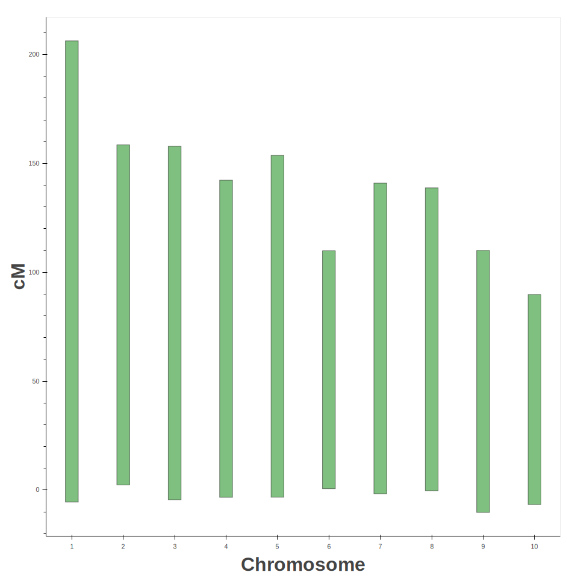
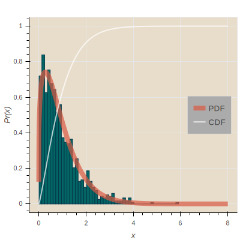

.. _notes on visualization:

######################
Visualization in Bokeh
######################

Making plots is quite irritating. I make plots far and few between so I always
forget the nuances of setting certain types parameters. Bokeh is a Python
package that makes use of Javascript and is far superior to Matplotlib. So I'm
writing this document to keep track of how I made all of my plots from
here on out.

.. _visualization_imports:

Module Imports for Packages Used to Make Plots
##############################################

.. code-block:: python
   :caption: Typical imports

   >>> import numpy as np
   >>> import pandas as pd
   >>> import simuOpt
   >>> simuOpt.setOptions(quiet=True, numThreads=4)
   >>> import simuPOP as sim
   >>> from saegus import analyze, parse, breed

.. _note_on_bokeh_and_jupyter_notebook:

Important Note
==============

The only difference for working in the Jupter Notebook using Bokeh is
the import of :func:`output_notebook` from :mod:`bokeh.io` . Using :func:`output_notebook`
does not preclude you from exporting ``.svg`` file.

.. _simple_bokeh_quad_plot:

Simple Bokeh Quad Plot
######################

.. code-block:: python
   :caption: In Jupyter Notebook

   >>> from bokeh.io import output_notebook, export_svgs, show
   >>> from bokeh.plotting import figure
   >>> p = figure(plot_width=400, plot_height=400, output_backend="svg")
   >>> p.quad(top=[2, 3, 4], bottom=[1, 2, 3], left=[1, 2, 3],
         right=[1.2, 2.5, 3.7])
   GlyphRenderer(id = '150ceca0-52d0-434c-becb-96bc8a19691f', …)
   >>> show()

.. image:: images/basic_bokeh_figure_quad.svg
   :align: center

.. _chromosome_ideograms:

Chromosome Ideogram
###################

A figure which shows the relative lengths of the chromosomes in terms of
centiMorgans. I think later on I will add a feature which will show the
locations of QTL or something like that. Something to visually depict the
distribution of loci and their effects.

.. code-block:: python
   :caption: Importing genetic map and visualizing relative sizes

   >>> gen_map = pd.read_csv('example_genetic_map.txt', index_col=0, sep='\t')
   >>> chromosome_bottoms = [min(gen_map.loc[gen_map['chr'] == i].cM) for i in range(1, 11)]
   >>> chromosome_tops = [max(gen_map.loc[gen_map['chr'] == i].cM) for i in range(1, 11)]
   >>> chromosome_factors = [str(i) for i in range(1, 11)]
   >>> chrom_ideograms = figure(plot_width=960, plot_height=960, x_range=chromosome_factors,
   ...                        title="Chromosome Ideogram Figure",
   ...                        output_backend="svg")
   >>> chrom_ideograms.xgrid.grid_line_color = None
   >>> chrom_ideograms.ygrid.grid_line_color = None
   >>> chrom_ideograms.vbar(x=chromosome_factors, top=chromosome_tops,
   ...                 bottom=chromosome_bottoms, width=0.25,
   ...                 line_width=1.0, line_color='black', fill_color='green',
   ...                 alpha=0.5)
   GlyphRenderer(
   id = '368a5815-446d-4154-8af9-bf8238d85e2b', ‹‹‹
   data_source = ColumnDataSource(id='c675e345-087a-472f-a219-c59ad757982a', ...),
   glyph = VBar(id='9eb8e5cb-6ca7-4aed-ad17-7b91a6660574', ...),
   hover_glyph = None,
   js_event_callbacks = {},
   js_property_callbacks = {},
   level = 'glyph',
   muted = False,
   muted_glyph = None,
   name = None,
   nonselection_glyph = VBar(id='a3aa9cd9-5216-4395-a242-db49895b6921', ...),
   selection_glyph = None,
   subscribed_events = [],
   tags = [],
   visible = True,
   x_range_name = 'default',
   y_range_name = 'default')

.. code-block:: python
   :caption: Adjusting some plot parameters

   >>> chrom_ideograms.xaxis.axis_label="Chromosome"
   >>> chrom_ideograms.xaxis.axis_label_text_font_size="24pt"
   >>> chrom_ideograms.xaxis.axis_label_text_font_style="bold"
   >>> chrom_ideograms.yaxis.axis_label="cM"
   >>> chrom_ideograms.yaxis.axis_label_text_font_size="24pt"
   >>> chrom_ideograms.yaxis.axis_label_text_font_style="bold"
   >>> show(chrom_ideograms)

.. _distribution_plots:

Distribution Plots
##################

.. _example_normal_dist_plot:

Example Normal Distribution Plot
================================

This is the code to produce an example of a normal distribution in the example
gallery. This same example also produces a

.. code-block:: python
   :caption: Example Plot from the gallery

   >>> p1 = figure(title="Normal Distribution (μ=0, σ=0.5)",tools="save",
   ...          background_fill_color="#E8DDCB", output_backend="svg")
   >>> mu, sigma = 0, 0.5
   >>> measured = np.random.normal(mu, sigma, 1000)
   >>> hist, edges = np.histogram(measured, density=True, bins=50)
   >>> x = np.linspace(-2, 2, 1000)
   >>> pdf = 1/(sigma * np.sqrt(2*np.pi)) * np.exp(-(x-mu)**2 / (2*sigma**2))
   >>> cdf = (1+scipy.special.erf((x-mu)/np.sqrt(2*sigma**2)))/2
   >>> p1.quad(top=hist, bottom=0, left=edges[:-1], right=edges[1:],
   ...       fill_color="#036564", line_color="#033649")
   >>> p1.line(x, pdf, line_color="#D95B43", line_width=8, alpha=0.7, legend="PDF")
   >>> p1.line(x, cdf, line_color="white", line_width=2, alpha=0.7, legend="CDF")
   >>> p1.legend.location = "center_right"
   >>> p1.legend.background_fill_color = "darkgrey"
   >>> p1.xaxis.axis_label = 'x'
   >>> p1.yaxis.axis_label = 'Pr(x)'

.. image:: images/example_normal_dist.svg
   :align: center

.. _example_gridplot_of_dist:

Example Gridplot
================

A gridplot can produce a layout of plots. Its input is a tuple of
:mod:`figure` objects.

.. code-block:: python
   :caption: Example of gridplot

   >>> p1 = figure(title="Normal Distribution (μ=0, σ=0.5)",tools="save",
   ...          background_fill_color="#E8DDCB")

   >>> mu, sigma = 0, 0.5

   >>> measured = np.random.normal(mu, sigma, 1000)
   >>> hist, edges = np.histogram(measured, density=True, bins=50)

   >>> x = np.linspace(-2, 2, 1000)
   >>> pdf = 1/(sigma * np.sqrt(2*np.pi)) * np.exp(-(x-mu)**2 / (2*sigma**2))
   >>> cdf = (1+scipy.special.erf((x-mu)/np.sqrt(2*sigma**2)))/2

   >>> p1.quad(top=hist, bottom=0, left=edges[:-1], right=edges[1:],
   ...      fill_color="#036564", line_color="#033649")
   >>> p1.line(x, pdf, line_color="#D95B43", line_width=8, alpha=0.7, legend="PDF")
   >>> p1.line(x, cdf, line_color="white", line_width=2, alpha=0.7, legend="CDF")

   >>> p1.legend.location = "center_right"
   >>> p1.legend.background_fill_color = "darkgrey"
   >>> p1.xaxis.axis_label = 'x'
   >>> p1.yaxis.axis_label = 'Pr(x)'

   >>> p2 = figure(title="Log Normal Distribution (μ=0, σ=0.5)", tools="save",
   ...          background_fill_color="#E8DDCB", output_backend="svg")

   >>> mu, sigma = 0, 0.5

   >>> measured = np.random.lognormal(mu, sigma, 1000)
   >>> hist, edges = np.histogram(measured, density=True, bins=50)

   >>> x = np.linspace(0.0001, 8.0, 1000)
   >>> pdf = 1/(x* sigma * np.sqrt(2*np.pi)) * np.exp(-(np.log(x)-mu)**2 / (2*sigma**2))
   >>> cdf = (1+scipy.special.erf((np.log(x)-mu)/(np.sqrt(2)*sigma)))/2

   >>> p2.quad(top=hist, bottom=0, left=edges[:-1], right=edges[1:],
   ...      fill_color="#036564", line_color="#033649")
   >>> p2.line(x, pdf, line_color="#D95B43", line_width=8, alpha=0.7, legend="PDF")
   >>> p2.line(x, cdf, line_color="white", line_width=2, alpha=0.7, legend="CDF")

   >>> p2.legend.location = "center_right"
   >>> p2.legend.background_fill_color = "darkgrey"
   >>> p2.xaxis.axis_label = 'x'
   >>> p2.yaxis.axis_label = 'Pr(x)'

   >>> p3 = figure(title="Gamma Distribution (k=1, θ=2)", tools="save",
   ...          background_fill_color="#E8DDCB", output_backend="svg")

   >>> k, theta = 1.0, 2.0

   >>> measured = np.random.gamma(k, theta, 1000)
   >>> hist, edges = np.histogram(measured, density=True, bins=50)

   >>> x = np.linspace(0.0001, 20.0, 1000)
   >>> pdf = x**(k-1) * np.exp(-x/theta) / (theta**k * scipy.special.gamma(k))
   >>> cdf = scipy.special.gammainc(k, x/theta) / scipy.special.gamma(k)

   >>> p3.quad(top=hist, bottom=0, left=edges[:-1], right=edges[1:],
   ...      fill_color="#036564", line_color="#033649")
   >>> p3.line(x, pdf, line_color="#D95B43", line_width=8, alpha=0.7, legend="PDF")
   >>> p3.line(x, cdf, line_color="white", line_width=2, alpha=0.7, legend="CDF")

   >>> p3.legend.location = "center_right"
   >>> p3.legend.background_fill_color = "darkgrey"
   >>> p3.xaxis.axis_label = 'x'
   >>> p3.yaxis.axis_label = 'Pr(x)'

   >>> p4 = figure(title="Weibull Distribution (λ=1, k=1.25)", tools="save",
   ...          background_fill_color="#E8DDCB", output_backend="svg")

   >>> lam, k = 1, 1.25

   >>> measured = lam*(-np.log(np.random.uniform(0, 1, 1000)))**(1/k)
   >>> hist, edges = np.histogram(measured, density=True, bins=50)

   >>> x = np.linspace(0.0001, 8, 1000)
   >>> pdf = (k/lam)*(x/lam)**(k-1) * np.exp(-(x/lam)**k)
   >>> cdf = 1 - np.exp(-(x/lam)**k)

   >>> p4.quad(top=hist, bottom=0, left=edges[:-1], right=edges[1:],
   ...     fill_color="#036564", line_color="#033649")
   >>> p4.line(x, pdf, line_color="#D95B43", line_width=8, alpha=0.7, legend="PDF")
   >>> p4.line(x, cdf, line_color="white", line_width=2, alpha=0.7, legend="CDF")

   >>> p4.legend.location = "center_right"
   >>> p4.legend.background_fill_color = "darkgrey"
   >>> p4.xaxis.axis_label = 'x'
   >>> p4.yaxis.axis_label = 'Pr(x)'

.. _exponential_dist_plot:

Exponential Distribution Plot
=============================

